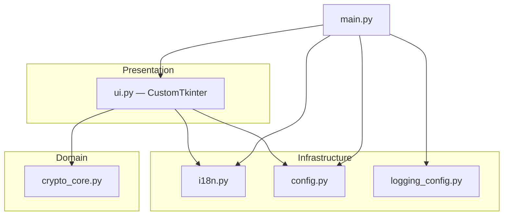

# Architecture

EntropyForge is a small desktop application with a strict separation between
cryptographic generation, internationalization, and presentation.

## Goals

| Goal | How it is met |
|------|----------------|
| Unpredictable generation | `secrets` module only in `crypto_core` (no `random`) |
| Testable core | Pure functions + explicit errors (`CryptoCoreError` + message keys) |
| i18n-ready UI | JSON locales; `t(key)` indirection |
| Auditable limits | Caps on password length and hex bytes to bound allocation |

## Layer diagram

## Data flow (generate)

1. User edits fields and triggers **Generate** (or Enter).
2. `ui._parse_request()` calls `parse_positive_int` / `parse_strict_int` in
   `crypto_core` (may raise `CryptoCoreError`).
3. Optional **paranoid** dialog for large outputs.
4. `generate_*` functions run using `secrets` only.
5. Entropy display uses `entropy_bits_*` helpers (informational, not a formal
   security audit).

## Configuration and logging

- **Settings:** JSON file under the OS user config directory (`platformdirs`),
  loaded/saved by `config.py`.
- **Logging:** File handler in `entropyforge.log` (warnings/errors from the
  `entropyforge` logger). **Secrets are never written to logs** by design.

## Threading model

Single-threaded Tk event loop. Long-running generation would block the UI;
bounds on output size keep operations fast.

## Internationalization

- Base strings: `locales/en.json`.
- Overlays: e.g. `locales/ar.json` merged in `load_locale()`.
- RTL chrome (`is_rtl()`) mirrors layout in `ui.py` for selected locales.

## Packaging

PyInstaller specs live at the repository root. See [PACKAGING.md](PACKAGING.md).
